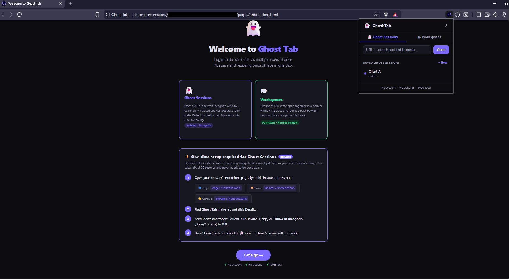

# 👻 Ghost Tab

**Log into the same site as multiple users simultaneously. No account, no tracking, 100% local.**

Ghost Tab is a browser extension for Edge, Brave, and Chrome with two modes:

| Mode | What it does |
|---|---|
| 👻 **Ghost Sessions** | Opens URLs in isolated incognito windows — separate cookie jar, separate login state. Run multiple accounts side by side. |
| 🗂 **Workspaces** | Saves groups of URLs that reopen together in one click. Cookies and logins persist between restarts. |
---

---
## Why Ghost Tab?

Every multi-account tool in this space either requires an account, charges a subscription, phones home, or is bloated with features you don't need.

Ghost Tab is:
- **Free** — forever, no plan tiers
- **No account** — install and go
- **No tracking** — zero network requests, ever
- **Open source** — read every line yourself
- **Tiny** — ~15KB total

---

## Installation

### From source (developer mode)

1. [Download the latest release](https://github.com/asoyd/ghost-tab/releases) and unzip
2. Open your browser's extensions page:
   - Edge: `edge://extensions`
   - Brave: `brave://extensions`
   - Chrome: `chrome://extensions`
3. Enable **Developer mode** (top right toggle)
4. Click **Load unpacked** → select the `ghost-tab-vx.x.x` folder

### Enable Ghost Sessions (incognito)

Ghost Sessions open incognito windows, which browsers block by default for extensions. One-time fix:

1. Go to your extensions page (see above)
2. Find **Ghost Tab** → click **Details**
3. Toggle **"Allow in InPrivate"** (Edge) or **"Allow in Incognito"** (Brave/Chrome) → **ON**

That's it. Never needs to be done again.

---

## Usage

### 👻 Ghost Sessions
- **Quick launch:** Paste any URL → click Open → fresh incognito window
- **Saved sessions:** Hit `+ New`, give it a name, add one or more URLs. They all open together in one incognito window.
- **Right-click** any link or page → "Open in Ghost Tab (incognito)"
- ⚠️ Login state is **not** saved between sessions (incognito by design). Use a password manager like [Bitwarden](https://bitwarden.com) to autofill credentials quickly.

### 🗂 Workspaces
- **Quick launch:** Paste any URL → opens in a new normal window
- **Saved workspaces:** Groups of URLs that open all at once. Cookies persist.
- **Save current tabs:** Click "📌 Save current tabs as workspace" to snapshot whatever you have open

---

## Password manager recommendation

Ghost Tab deliberately does **not** store passwords. Use [Bitwarden](https://bitwarden.com) (free, open source) alongside Ghost Tab — enable it in incognito too and it will autofill credentials inside Ghost Sessions automatically.

---

## Privacy

Ghost Tab makes **zero network requests**. All data (saved sessions, workspaces) is stored locally using `chrome.storage.local` and never leaves your device. See [PRIVACY.md](PRIVACY.md).

---

## Contributing

PRs welcome. Keep it lean — the goal is a focused tool that does two things well, not a platform.

```
ghost-tab-v1/
├── manifest.json       # Extension manifest (MV3)
├── background.js       # Service worker: session logic, context menu
├── popup.html          # Extension popup UI
├── popup.js            # Popup logic
├── icons/              # PNG icons (16, 48, 128px)
└── pages/
    ├── onboarding.html # First-install welcome page
    └── onboarding.js
```

---

## License

MIT — do whatever you want with it.
